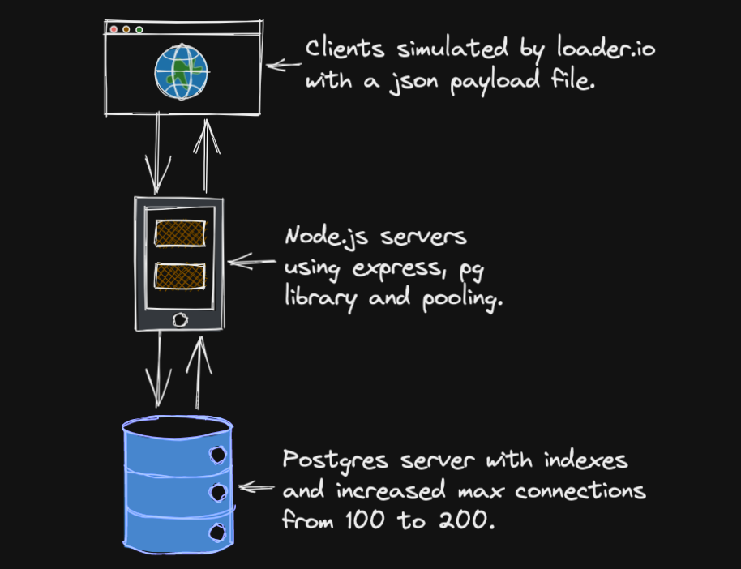

# Project 1000RPS

- A high performance back-end service for a ratings & reviews feature of an e-commerce website. The only constraint is that the service must be deployed on free tier AWS EC2 micro instances. The goal was make a backend that could handle 1000 http requests per second.

## Software Engineer 

   •[Tim Mussack](https://github.com/timmussack) - Ratings & Reviews 

## Tech Stack

## Progress Narrative

- Four csv files were provided to me at the beginning of the project. The relational structure of the data led me to choose -Postgres as a database management system. I wrote sql script files to build the database & complete the ETL process programatically. I then wrote and tested sql queries to create, read and update records in the database. After indexing highly searched columns, queries took around 5-35 ms to run. The slowest queries are SELECT statements from the reviews table where the given product id has approximately 50 or more records.

- After the database and queries were complete, I started a node server using express, wrotes routes and handled database connections with pg (postgres-node). Controller functions were made to handle database CRUD logic. I then used Artillery to test the system locally. I ran Artillery tests using one node server & then tested again with two node clusters serving requests to each server in round robin. Pm2, a node.js process manager facilitated this. The system using two node.js clusters was able to handle approximately double the number of requests.

- I initially deployed the project with no scaling and ran some tests and then because of my earlier Artillery tests I decided to implement horizontal scaling using 6 free tier Ubuntu EC2 instances. The two main read and write end points were tested with loader.io in order to compare pre and post scaling performance. Below you can see a diagram of both scenarios.

## Cloud Architecture Before Scaling

## Cloud Architecture After Scaling

## Test Results
#### 15 second loader.io test at 1000 RPS on post reviews endpoint
- The post reviews route achieved 1000 requests per second with a 0% error rate and an average response time of 127 ms. A total of 5.6MB of review data was sent from the client requests and saved to the database.
  - Before scaling, this route would finish the same test with an average response time of 2312 ms with a 0% error rate.
  - The improvement from scaling resulted in a 94.5% decrease in client wait time while maintaining a 0% error rate.

#### 15 second loader.io test at 500 RPS on get reviews endpoint
- The get reviews route achieved 500 requests per second with a 0% error rate and an average response time of 71 ms. A total of 84MB of review data was received by the client from the database.
  - Before scaling, this route would finish the same test with an average response time of 2209 ms with a .2% timeout   error rate.
  - The improvement from scaling resulted in a 96.7% decrease in client wait time while also achieving a 0% error rate from .2%.

## Other Optimizations 
- Regularly searched table columns were indexed using BTree to ensure database queries were between 1-35 ms. Before indexing, some queries took 5000 ms.
- Max connections allowed on the Postgres database were increased from 100 to 200. This change was prompted by data base errors encountered during loader.io testing.
- The number of worker connections in Nginx was increased from 768 to 4096. This change was prompted by Nginx error logs encountered during loader.io testing. The number of files accessible to worker connections was also increased to 30000.
- Keep alive connections between Nginx and backend servers were also enabled and configured. This minimizes time needed to make repeated authentication hand shakes. This optimization was prompted by Nginx blog post. In a production environment this decision needs careful consideration as it can make your server vulnerable to desynchronization attacks.

## Helpful Postgres & ETL Commands

#### Check if postgresql server is running locally
> brew services

#### Start the postgresql server if it isn't already running
> brew services restart postgresql@15

#### Stop postgresql server
> brew services stop postgresql

#### Set expanded view to auto (on, off are also options)
> \x auto

#### Turn on timing to benchmark queries in psql (terminal)
> \timing

#### Opens postgres in terminal with user 'sdc',
> psql -U 'user name' 'database name'

#### Stops postgres in terminal
> \q

#### Switch to database of choice
> \c database 'db_name'

#### Show tables in database
> \dt

#### Describe a table with extra information
> \d+ 'table name'

#### Return number of rows in a table
> SELECT count(*) FROM 'table name';

#### Run sql file scripts in build_db folder to set up data base
> psql -U 'username' -d 'database name' -a -f 'file name'.sql

#### Check what index's a table has
> SELECT indexname, indexdef FROM pg_indexes WHERE tablename = 'table name';

#### If primary key sequence falls out of synce run the fix_sequences script
> psql -U 'username' -d 'database' -a -f fix_sequences.sql;

#### Create pgsql file of the database to transfer database to cloud server
> pg_dump -U 'username' -f 'name the file'.pgsql -C 'database name'

#### Send the pgsql file to cloud server using scp
> scp -i ~'path to pem key' 'pem key file name'.pem 'pgsql file name'.pgsql 'location of cloud server'
